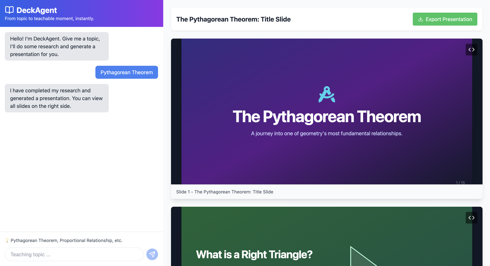

# 🎓 DeckAgent

[](https://deckagent.lovable.app)
[](LICENSE)

**[Try the Live Demo!](https://deckagent.lovable.app)**



Transform any topic into a comprehensive, beautifully-designed educational presentation in minutes! 🚀 DeckAgent leverages advanced AI to research your topic and generate professional HTML slides that are ready to present.

## ✨ Features

- **🔍 Intelligent Research**: Automatically researches your topic using web search to gather comprehensive, up-to-date information
- **🤖 Multi-Agent Architecture**: Powered by Google ADK with specialized agents for research and presentation design
- **🎨 Beautiful Slide Design**: Generates modern, responsive HTML slides with gradient themes and smooth animations
- **💬 Interactive Chat Interface**: Simple conversation-based workflow - just tell DeckAgent what you want to teach
- **📊 Real-time Preview**: See your slides rendered in real-time as they're generated
- **💾 Export Ready**: Download individual slides or the complete presentation
- **🎯 Education-Focused**: Specifically optimized for creating teaching materials with clear learning objectives

## 🏗️ Architecture

DeckAgent uses a sophisticated multi-agent system:

```
User Input → Research Loop Agent → Presentation Agent → HTML Slides
                    ↓
              Web Search Agent
```

- **Research Loop Agent**: Manages the research process, breaking down topics into key areas
- **Web Search Agent**: Gathers information from the web on concepts, examples, and teaching strategies
- **Presentation Agent**: Transforms research into beautifully-designed HTML slides

## 🚀 Getting Started

### Prerequisites

- [Node.js](https://nodejs.org/) (v18 or higher)
- [Python](https://www.python.org/) (v3.8 or higher)
- [Google ADK](https://github.com/google/adk) for running the agent backend
- API keys for Gemini and Anthropic Claude

### Installation

1. **Clone the repository**
   ```bash
   git clone https://github.com/yourusername/deckagent.git
   cd deckagent
   ```

2. **Install frontend dependencies**
   ```bash
   npm install
   ```

3. **Set up the agent backend**
   ```bash
   cd agents
   pip install google-adk
   ```

4. **Configure environment variables**
   
   Create a `.env` file in the root directory:
   ```env
   VITE_API_URL=http://localhost:5001
   ```

   Set up ADK credentials:
   ```bash
   export GOOGLE_API_KEY=your_gemini_api_key
   export ANTHROPIC_API_KEY=your_claude_api_key
   ```

5. **Start the development servers**

   In one terminal, start the agent server:
   ```bash
   cd agents
   adk run deck_agent --port 5001
   ```

   In another terminal, start the frontend:
   ```bash
   npm run dev
   ```

   Your app will be running at `http://localhost:5173`!

## 💻 Usage

1. **Enter a Topic**: Type any educational topic in the chat interface
2. **Wait for Research**: DeckAgent will search and compile information about your topic
3. **Review & Generate**: The AI will create a complete presentation with 8-12 slides
4. **Preview & Export**: View your slides in real-time and export as needed

### Example Topics
- "Introduction to Machine Learning"
- "The Solar System for Elementary Students"
- "Basics of Financial Literacy"
- "Understanding Climate Change"

## 🛠️ Tech Stack

### Frontend
- **React** with TypeScript
- **Vite** for fast development
- **Tailwind CSS** for styling
- **shadcn/ui** for UI components
- **Lucide Icons** for beautiful icons

### Backend
- **Google ADK** (Agent Development Kit)
- **Anthropic Claude Opus** for coordination
- **Google Gemini** for research and content generation
- **Python** for agent implementation

## 📁 Project Structure

```
deckagent/
├── src/
│   ├── components/
│   │   └── DeckAgent.tsx    # Main React component
│   ├── App.tsx
│   └── main.tsx
├── agents/
│   └── deck_agent/
│       ├── __init__.py
│       └── agent.py         # Multi-agent implementation
├── public/
├── package.json
└── README.md
```

## 🤝 Contributing

Contributions are welcome! Please feel free to submit a Pull Request. For major changes, please open an issue first to discuss what you would like to change.

1. Fork the Project
2. Create your Feature Branch (`git checkout -b feature/AmazingFeature`)
3. Commit your Changes (`git commit -m 'Add some AmazingFeature'`)
4. Push to the Branch (`git push origin feature/AmazingFeature`)
5. Open a Pull Request

## 📄 License

This project is licensed under the MIT License - see the [LICENSE](LICENSE) file for details.

## 🙏 Acknowledgments

- Built with [Lovable.dev](https://lovable.dev)
- Powered by [Google ADK](https://github.com/google/adk)
- UI components from [shadcn/ui](https://ui.shadcn.com)
- Icons from [Lucide](https://lucide.dev)

## 🔗 Links

- [Live Demo](https://lovable.dev/projects/87a633cb-9732-4212-af45-bf52dec546f7)
- [Documentation](docs/README.md)
- [Issue Tracker](https://github.com/yourusername/deckagent/issues)

---

<p align="center">Made with ❤️ by educators, for educators</p>